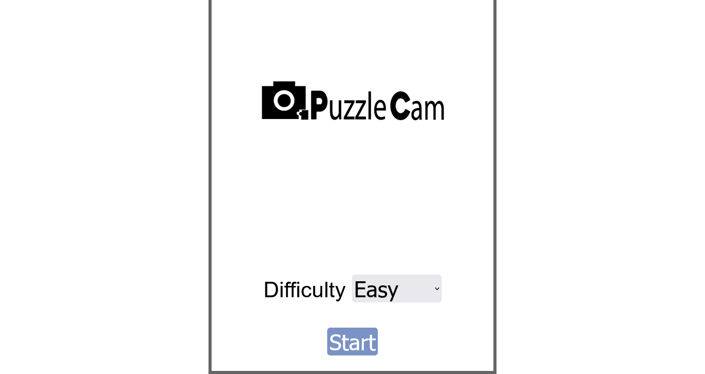

<h1>PuzzleCam :camera:</h1>

<h2>A puzzle cam game created using HTML, CSS, JavaScript, and a bit of PHP and MySql.</h2>

This game was created using HTML, CSS, and JavaScript that lets you play a puzzle game using your camera from your desktop and it uses PHP and MySql to store the scores. This was created following the tutorial of Radu Mariescu-Istodor. Screenshot of the game.

- Live Site: [PuzzleCam](https://puzzle-cam-game.netlify.app/)

### Screenshots

